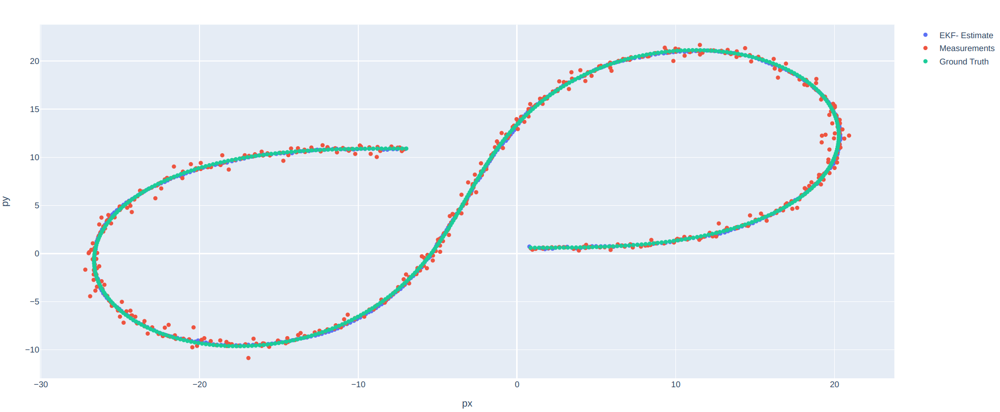

# 优达学城 传感器融合课程
## lidar模块  
### lidar object detection

 
## camera模块  
matched keypoints  

  
  TTC lidar and TTC camera

## no radar
  不会matlab

## kalman filter
ukf demo  

## ekf scatter demo 
folder: 05_sensor_fusion_demo_py

## reference  
https://github.com/fanweng/Udacity-Sensor-Fusion-Nanodegree